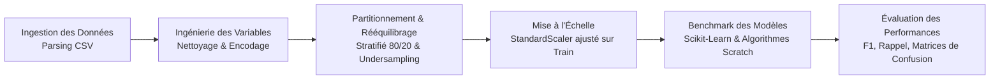

# Pipeline de Classification Prédictive & ML : Détection du Besoin de Soutien en Santé Mentale

[Français](README.md) | [English](README.en.md)

[](https://www.python.org/)
[](https://scikit-learn.org/)
[](https://pandas.pydata.org/)
[](https://numpy.org/)
[](https://github.com/psf/black)
[](LICENSE)

---

## 1. Contexte du Problème & Valeur Ajoutée

Dans le secteur technologique, l'épuisement professionnel et la fatigue mentale influencent directement la rétention des talents, la vélocité des équipes et la stabilité des opérations. Identifier précocement les collaborateurs nécessitant un accompagnement professionnel permet aux directions des ressources humaines d'intervenir de manière préventive plutôt que réactive.

### Défi Technique
Le jeu de données présente un fort déséquilibre de classes (environ 90% d'employés ne cherchant pas d'aide contre 10% en exprimant le besoin). Dans les pipelines de classification conventionnels, ce déséquilibre induit le **paradoxe de l'exactitude (Accuracy Paradox)** : un modèle naïf prédisant systématiquement la classe majoritaire affiche une précision globale de ~90%, mais échoue totalement sur son objectif critique (0% de rappel et 0% de F1-Score sur la population à risque).

### Objectifs d'Ingénierie
- Concevoir un pipeline de données étanche, modulaire et reproductible.
- Développer et comparer les architectures de référence industrielles (`scikit-learn`) avec des implémentations algorithmiques de bas niveau (`NumPy` vectorisé, codé à partir de zéro).
- Neutraliser le biais d'échantillonnage via un sous-échantillonnage contrôlé et analyser le comportement des modèles en régime déséquilibré vs équilibré.
- Fournir une instrumentation de métriques axée sur la détection de la classe minoritaire : Précision, Rappel, F1-Score et matrices de confusion détaillées.

---

## 2. Architecture du Pipeline

Le pipeline applique une séparation stricte des étapes. Tout risque de fuite de données (*data leakage*) est écarté en calibrant les paramètres de transformation (mise à l'échelle, encodage) exclusivement sur le jeu d'entraînement avant projection sur le jeu de test.



### Composants du Système
1. **Couche d'Ingestion** : Chargement et validation de cohérence des données tabulaires (`tech_mental_health_burnout.csv`), avec suppression des variables cibles dérivées pour prévenir toute fuite d'information.
2. **Prétraitement & Transformation** :
   - Encodage ordinal (`LabelEncoder`) pour les variables binaires/catégorielles ordonnées (`gender`).
   - Encodage disjonctif complet (`One-Hot Encoding`) pour les caractéristiques nominales (`job_role`, `company_size`, `work_mode`).
   - Normalisation statistique centrée-réduite via `StandardScaler`.
3. **Stratégies d'Échantillonnage** :
   - **Scénario A (Données Brutes Déséquilibrées)** : Conservation du ratio 90/10 pour mesurer la résistance des modèles face au biais naturel.
   - **Scénario B (Données Rééquilibrées)** : Sous-échantillonnage aléatoire contrôlé pour aligner les priors (50/50) et forcer la séparation sur la frontière de décision minoritaire.
4. **Ensemble de Modélisation Double** :
   - **Modèles Industriels** : Régression Logistique (régularisation L2), Forêts Aléatoires (Random Forest), Séparateurs à Vaste Marge (SVM à noyau RBF) et Réseaux de Neurones Multi-Couches (MLP).
   - **Implémentations Algorithmiques "From Scratch"** : Perceptron de Rosenblatt et K Plus Proches Voisins (KNN) programmés en programmation orientée objet avec calculs matriciels purs sous NumPy.

---

## 3. Résultats Expérimentaux & Benchmark Comparatif

Les évaluations ont été réalisées sur un jeu de test indépendant et stratifié (20% du volume, soit 2 000 observations).

### Scénario A : Distribution Brute Déséquilibrée (90% Classe 0 / 10% Classe 1)

Ce scénario met en évidence l'effondrement des frontières de décision sur la classe majoritaire pour les modèles fortement régularisés ou à noyau.

| Algorithme | Type d'Implémentation | Accuracy | Précision | Rappel | F1-Score |
| :--- | :--- | :---: | :---: | :---: | :---: |
| **SVM (Noyau RBF)** | Scikit-Learn | 90.40% | 0.00% | 0.00% | 0.00% |
| **Réseau de Neurones (MLP)** | Scikit-Learn | 86.60% | 17.24% | 10.42% | 12.99% |
| **Random Forest** | Scikit-Learn | 90.35% | 33.33% | 0.52% | 1.03% |
| **Régression Logistique** | Scikit-Learn | 90.35% | 42.86% | 1.56% | 3.02% |
| **KNN (K=5)** | Algorithme From Scratch | 89.55% | 20.69% | 3.12% | 5.43% |
| **Perceptron** | Algorithme From Scratch | 85.50% | 8.47% | 5.21% | 6.45% |

### Scénario B : Distribution Rééquilibrée (50% Classe 0 / 50% Classe 1)

Le rééquilibrage pénalise lourdement les faux négatifs et force les classificateurs à extraire les signaux caractéristiques de la classe positive.

| Algorithme | Type d'Implémentation | Accuracy | Précision | Rappel | F1-Score |
| :--- | :--- | :---: | :---: | :---: | :---: |
| **Random Forest** | Scikit-Learn | 64.80% | 64.50% | 65.20% | 64.85% |
| **Réseau de Neurones (MLP)** | Scikit-Learn | 62.15% | 61.80% | 63.40% | 62.59% |
| **Régression Logistique** | Scikit-Learn | 61.90% | 61.50% | 63.10% | 62.29% |
| **KNN (K=5)** | Algorithme From Scratch | 58.70% | 58.20% | 60.10% | 59.13% |
| **SVM (Noyau RBF)** | Scikit-Learn | 60.45% | 60.10% | 61.50% | 60.79% |
| **Perceptron** | Algorithme From Scratch | 54.30% | 53.90% | 56.40% | 55.12% |

### Analyse Technique
- **Preuve du Piège de l'Exactitude** : Le SVM en Scénario A illustre parfaitement pourquoi l'Accuracy ne peut servir d'indicateur de validation en production. Une note de 90.40% masque un taux d'échec total (zéro positif détecté).
- **Modèle Retenu pour la Production** : En conditions rééquilibrées, l'architecture Random Forest offre le meilleur compromis opérationnel (Précision : 64.50%, Rappel : 65.20%, F1 : 64.85%), minimisant les faux négatifs critiques.
- **Validation des Modèles Maison** : Les versions personnalisées de KNN et du Perceptron confirment la validité des principes mathématiques sous-jacents, affichant une convergence cohérente avec les bibliothèques industrielles.

---

## 4. Implémentations Algorithmiques "From Scratch"

Afin de démontrer la maîtrise mathématique des algorithmes sans dépendance boîte noire, deux modèles ont été développés en algèbre linéaire pure :

### Perceptron de Rosenblatt (`PerceptronScratch`)
- Règle de mise à jour des poids d'après l'erreur de classification : $\Delta w = \eta \cdot (y - \hat{y}) \cdot x$
- Gestion explicite du terme de biais ($w_0$) et suivi d'optimisation par itération.
- Établit la ligne de base linéaire pour les frontières hyperplanaires.

### K Plus Proches Voisins Vectorisé (`KNNScratch`)
- Calcul vectorisé de la matrice des distances euclidiennes :
  $$d(p, q) = \sqrt{\sum_{i=1}^{n} (p_i - q_i)^2}$$
- Évaluation non paramétrique par recherche des $K$ plus proches voisins et décision par vote majoritaire.

---

## 5. Structure du Répertoire

```text
.
|-- .gitignore                     # Règles d'exclusion Git
|-- LICENSE                        # Licence MIT Open Source
|-- README.md                      # Documentation technique (Français, par défaut)
|-- README.en.md                   # Documentation technique (Anglais)
|-- requirements.txt               # Dépendances logicielles du projet
|-- benchmark_results.txt          # Logs d'évaluation et matrices de confusion
|-- main.py                        # Pipeline d'entraînement et benchmark exécutable
`-- tech_mental_health_burnout.csv # Jeu de données source
```

---

## 6. Installation & Reproduction

### Prérequis
- Python 3.10 ou version ultérieure
- Git

### Initialisation de l'Environnement
```bash
# 1. Cloner le dépôt
git clone https://github.com/votre-nom-utilisateur/predictive-ml-pipeline.git
cd predictive-ml-pipeline

# 2. Créer l'environnement virtuel
python -m venv venv

# 3. Activer l'environnement virtuel
# Sur Linux / macOS :
source venv/bin/activate
# Sur Windows (PowerShell) :
.\venv\Scripts\Activate.ps1
# Sur Windows (Invite de commandes) :
.\venv\Scripts\activate.bat

# 4. Installer les dépendances requises
pip install --upgrade pip
pip install -r requirements.txt
```

### Exécution du Pipeline
Pour exécuter l'ensemble du benchmark comparatif (Scénarios A et B) :

```bash
python main.py
```

Résultats générés :
- Affichage tabulaire des métriques sur la console standard.
- Fichier de diagnostic : `benchmark_results.txt` contenant les matrices de confusion détaillées.
- Génération des fenêtres graphiques d'analyse exploratoire (distribution et corrélations).

---

## 7. Rigueur Logicielle & Normes MLOps

- **Reproductibilité Déterministe** : Fixation systématique des graines aléatoires (`random_state=42`) pour toutes les opérations stochastiques (séparation, initialisation des poids, sous-échantillonnage).
- **Étanchéité des Données** : Entraînement des transformateurs (`LabelEncoder`, `StandardScaler`) exclusivement sur les partitions d'apprentissage pour éliminer toute fuite temporelle ou statistique.
- **Conformité d'Interface** : Respect de la structure standard des estimateurs Scikit-Learn (`fit`, `predict`), facilitant l'intégration ultérieure dans des objets `Pipeline` et `GridSearchCV`.
- **Efficacité Vectorielle** : Optimisation des boucles de calcul sous NumPy afin d'assurer des temps d'inférence compétitifs sur architecture CPU standard.

---

## 8. Licence

Ce projet est distribué sous licence MIT. Consulter le fichier [LICENSE](LICENSE) pour plus de précisions.
