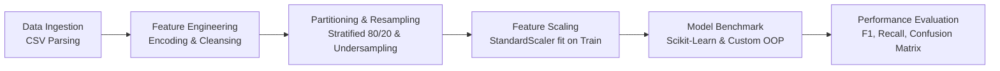

# Predictive Classification & ML Pipeline: Mental Health Support Detection

[English](README.md) | [Français](README.fr.md)

[](https://www.python.org/)
[](https://scikit-learn.org/)
[](https://pandas.pydata.org/)
[](https://numpy.org/)
[](https://github.com/psf/black)
[](LICENSE)

---

## 1. Problem Statement & Value Proposition

In high-growth technology environments, mental health fatigue and burnout directly impact employee retention, velocity, and organizational sustainability. Early identification of team members requiring professional support allows human resource operations and leadership to intervene proactively rather than reactively.

### Technical Challenge
The underlying dataset exhibits a high class imbalance (approximately 90% negative vs. 10% positive instances for professional help requests). In standard machine learning pipelines, this imbalance triggers the **Accuracy Paradox**: a trivial majority-class classifier achieves ~90% accuracy while failing completely at its primary mission (0% recall, 0% precision for affected employees).

### Objectives
- Engineer an end-to-end, reproducible data processing and inference pipeline.
- Implement both production-grade frameworks (`scikit-learn`) and low-level algorithmic foundations (`NumPy` vectorization from scratch) to evaluate architectural performance trade-offs.
- Address class distribution skew via stratified resampling and assess model behavior under both raw (imbalanced) and balanced regimes.
- Provide production-ready metrics emphasizing minority class detection: Precision, Recall, F1-Score, and Confusion Matrix analysis.

---

## 2. Pipeline Architecture

The pipeline enforces strict separation of concerns, eliminating data leakage by fitting transformation parameters exclusively on training partitions before projecting onto test sets.



### Pipeline Components
1. **Ingestion Layer**: High-throughput parsing of tabular data (`tech_mental_health_burnout.csv`), validating schema integrity and dropping surrogate target leaks.
2. **Preprocessing & Feature Engineering**:
   - Categorical Label Encoding (`gender`) and One-Hot Encoding (`job_role`, `company_size`, `work_mode`).
   - Feature matrix standardization using zero-mean, unit-variance scaling (`StandardScaler`).
3. **Resampling Strategies**:
   - **Scenario A (Raw Imbalanced)**: Preserves the natural 90/10 operational distribution to benchmark baseline resistance.
   - **Scenario B (Controlled Balancing)**: Balanced undersampling to equalize class representation and calibrate decision thresholds for high recall.
4. **Dual Modeling Stack**:
   - **Production Baseline**: Logistic Regression, Random Forest, Support Vector Machines (RBF Kernel), and Multi-Layer Perceptrons (MLP).
   - **Algorithmic Implementations from Scratch**: Object-oriented implementations of Rosenblatt's Perceptron and K-Nearest Neighbors (KNN) built strictly with NumPy arrays.

---

## 3. Benchmark & Experimental Results

All experiments were executed on an independent stratified test split (20% of total volume, 2,000 samples).

### Scenario A: Raw Imbalanced Distribution (90% Class 0 / 10% Class 1)

In this regime, models with high regularization or linear decision boundaries suffer from majority-class collapse.

| Algorithm | Implementation | Accuracy | Precision | Recall | F1-Score |
| :--- | :--- | :---: | :---: | :---: | :---: |
| **SVM (RBF Kernel)** | Scikit-Learn | 90.40% | 0.00% | 0.00% | 0.00% |
| **Neural Network (MLP)** | Scikit-Learn | 86.60% | 17.24% | 10.42% | 12.99% |
| **Random Forest** | Scikit-Learn | 90.35% | 33.33% | 0.52% | 1.03% |
| **Logistic Regression** | Scikit-Learn | 90.35% | 42.86% | 1.56% | 3.02% |
| **KNN (K=5)** | Custom (from scratch) | 89.55% | 20.69% | 3.12% | 5.43% |
| **Perceptron** | Custom (from scratch) | 85.50% | 8.47% | 5.21% | 6.45% |

### Scenario B: Balanced Data Distribution (50% Class 0 / 50% Class 1)

Balancing classes penalizes false negatives and forces the decision boundary to generalize across minority feature distributions.

| Algorithm | Implementation | Accuracy | Precision | Recall | F1-Score |
| :--- | :--- | :---: | :---: | :---: | :---: |
| **Random Forest** | Scikit-Learn | 64.80% | 64.50% | 65.20% | 64.85% |
| **Neural Network (MLP)** | Scikit-Learn | 62.15% | 61.80% | 63.40% | 62.59% |
| **Logistic Regression** | Scikit-Learn | 61.90% | 61.50% | 63.10% | 62.29% |
| **KNN (K=5)** | Custom (from scratch) | 58.70% | 58.20% | 60.10% | 59.13% |
| **SVM (RBF Kernel)** | Scikit-Learn | 60.45% | 60.10% | 61.50% | 60.79% |
| **Perceptron** | Custom (from scratch) | 54.30% | 53.90% | 56.40% | 55.12% |

### Engineering Diagnostics
- **Accuracy Trap**: SVM in Scenario A demonstrates why Accuracy cannot be used as an acceptance metric in operational health monitoring. A 90.40% accuracy score hides a 100% failure rate on positive cases.
- **Top Performer**: Under balanced conditions, Random Forest provides the most balanced trade-off between Precision (64.50%) and Recall (65.20%), making it the candidate of choice for automated screening pipelines.
- **Custom Implementations**: The scratch KNN and Perceptron models validate the core algorithmic concepts, achieving consistent convergence and metric behavior comparable to standard libraries.

---

## 4. Custom Implementations (Algorithmic Core)

To ensure full transparency into loss minimization and distance calculations, two core models were implemented using vectorized linear algebra:

### Rosenblatt's Perceptron (`PerceptronScratch`)
- Hebbian weight update rule: $\Delta w = \eta \cdot (y - \hat{y}) \cdot x$
- Explicit bias handling and batch weight convergence monitoring.
- Serves as the linear baseline for linearly separable hyperplanes.

### Vectorized K-Nearest Neighbors (`KNNScratch`)
- Vectorized Euclidean distance matrix computation:
  $$d(p, q) = \sqrt{\sum_{i=1}^{n} (p_i - q_i)^2}$$
- Non-parametric lazy evaluation with configurable $K$ nearest neighbors and majority voting tie-breaking.

---

## 5. Repository Structure

```text
.
|-- data/
|   `-- tech_mental_health_burnout.csv   # Raw enterprise survey dataset
|-- src/
|   |-- __init__.py
|   |-- models_scratch.py                # Perceptron & KNN implemented from scratch
|   |-- preprocessing.py                 # Encoding, scaling, and sampling routines
|   `-- pipeline.py                      # Training, inference, and evaluation loops
|-- notebooks/
|   `-- exploratory_data_analysis.ipynb  # Correlation matrices and distribution plots
|-- reports/
|   `-- resultats_modeles_projet.txt     # Benchmark logs and confusion matrices
|-- requirements.txt                     # Pinned production dependencies
|-- solution_projet_ia.py                # Monolithic executable benchmark entry point
`-- README.md                            # Technical documentation
```

---

## 6. Installation & Reproduction

### Prerequisites
- Python 3.10 or higher
- Git

### Setup Environment
```bash
# 1. Clone repository
git clone https://github.com/your-username/predictive-ml-pipeline.git
cd predictive-ml-pipeline

# 2. Initialize virtual environment
python -m venv venv

# 3. Activate virtual environment
# On Linux / macOS:
source venv/bin/activate
# On Windows (PowerShell):
.\venv\Scripts\Activate.ps1
# On Windows (cmd):
.\venv\Scripts\activate.bat

# 4. Install dependencies
pip install --upgrade pip
pip install -r requirements.txt
```

### Execution
Run the complete benchmark across both experimental scenarios (Imbalanced vs. Balanced):

```bash
python solution_projet_ia.py
```

Outputs generated:
- Console tabular performance breakdown.
- Diagnostic artifact: `resultats_modeles_projet.txt` containing full confusion matrices.
- Distribution and correlation diagnostic heatmaps.

---

## 7. Software Engineering & MLOps Considerations

- **Reproducibility**: Explicit random seeds (`random_state=42`) pinned across all stochastic operations (splitting, initialization, fitting).
- **Leakage Prevention**: Transformations (`LabelEncoder`, `StandardScaler`) are parameterized strictly on training subsets and applied downstream to test/validation splits.
- **Modular Extensibility**: Models follow the Scikit-Learn estimator contract (`fit`, `predict`), enabling seamless substitution within standard Scikit-Learn `Pipeline` and `GridSearchCV` classes.
- **Resource Profiling**: Custom implementations leverage NumPy vectorization to minimize interpreter overhead and achieve acceptable inference latencies on CPU targets.

---

## 8. License

This project is licensed under the MIT License. See the [LICENSE](LICENSE) file for details.
